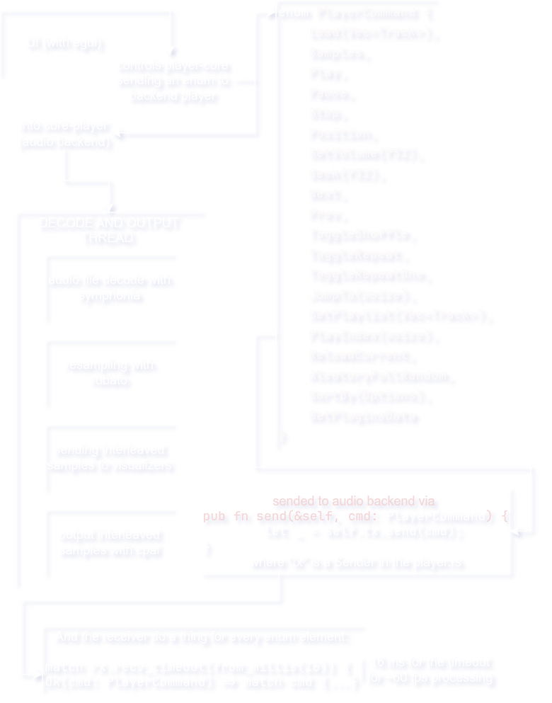

  
# ReAmped
### A modern audio player focused on **visuals**, **performance**, and **extensibility**
  

Lightweight music player with real-time visualizers and other nice things

---

# Overview

**ReAmped** is a modern music player designed around **real-time audio visualization**.

It combines:

- Smooth music playback  
- Reactive visualizers  
- A modular plugin system -- _**under development**_

All built with **performance and extensibility in mind**.

---

# Preview

---

# Download

Precompiled binaries are available in **GitHub Releases**.

[**Download here**](https://github.com/XxAlexplosivoxX/ReAmped/releases)

Supported platforms:

<table>
  <thead>
    <tr>
      <td>OS</td>
      <td>it runs?</td>
    </tr>
  </thead>
  <tbody>
    <tr>
      <td>Linux</td>
      <td>Yeah, it's on the releases as a precompiled binary</td>
    </tr>
    <tr>
      <td>Windows</td>
      <td>Sure, it's on the releases as a precompiled binary</td>
    </tr>
    <tr>
      <td>Android</td>
      <td>🗣️🗣️ Hell naah ❌❌❌❌ <i>(only if core-player is correctly functional in Android maybe)</i></td>
    </tr>
  </tbody>
</table>

No compilation required.

Just download and run.

---

# Features

## Audio Playback

- Fast audio playback engine
- Playlist support
- Shuffle / repeat / repeat-one modes
- Library scanning
- Volume control

---

# Architecture

  

---

## Audio Meters 
>Under development, but i think make it like a DAW or something

---

## Visualizers

ReAmped renders **audio visualizations in real time**.

Examples include:

- Spectrum analyzer
- Beat reactive visuals
- Waveform displays
- Dynamic UI color themes

---

## Plugin System
>Under Development

# Contributing to ReAmped

Thank you for your interest in contributing to ReAmped.

ReAmped is an experimental audio player focused on performance, real-time audio visualization. The project aims to provide a modern and extensible audio playback environment with minimal overhead and a modular architecture.

Contributions of all kinds are welcome.

## Ways to Contribute

You can contribute in many ways, including:

- fixing bugs
- improving performance
- creating visualizers
- improving UI layout
- suggesting new features
- improving code readability
- reporting issues

Even small improvements are appreciated.

## Development Focus

ReAmped is built with several main areas of development.

### Audio Core

The audio core is responsible for:

- playback
- plugin processing
- audio analysis
- feeding visualizers

Important rules:

- avoid allocations inside the audio processing thread
- keep audio processing deterministic
- prefer simple and predictable DSP code

### Visualizers

Visualizers receive analyzed audio data and render graphics in real time.

### User Interface

The UI is built using egui.

Contributions here may include:

- layout improvements
- new UI components
- improved responsiveness
- visual polish
- customizable themes
- better meter displays

## Android Support

Android is currently NOT supported.

The core audio engine (player-core) relies on the cpal crate for audio output.  
On Android, cpal attempts to use the AAudio backend.

At the moment this configuration does not compile reliably, which prevents building the project for Android.

Until the upstream issues with cpal and AAudio are resolved, an official Android version will not be developed.

Community experiments are welcome, but Android support is not planned until the backend situation improves.

## Pull Request Guidelines

When submitting a pull request:

- keep changes focused and minimal
- avoid mixing unrelated changes
- ensure the project builds successfully
- explain what the change does and why

Small and well-scoped pull requests are easier to review.

## Code Style

General guidelines:

- keep modules simple and readable
- avoid unnecessary abstractions
- prefer explicit code over clever code
- keep audio processing fast and predictable

## Feature Requests

If you want to suggest a feature:

1. open an issue
2. describe the idea clearly
3. explain the use case

Discussion is always welcome.

## Final Notes

ReAmped is still evolving and the architecture may change as the project grows.

Thanks for your interest in contributing.
